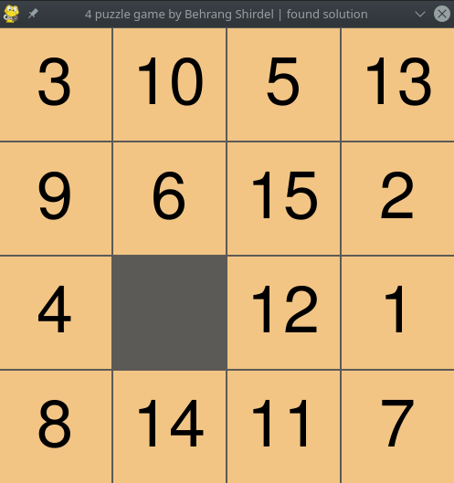

# 15-Puzzle solver with IDA* algorithm & pattern DB

  ##### how to use

* pip install -r requirements
* python lunch.py
* press 's' to shuffle
* press 'f':
    * for the first time finds the best solution
    * next time moves the blank tile

##### create database
* python db.py

##### screen shot

